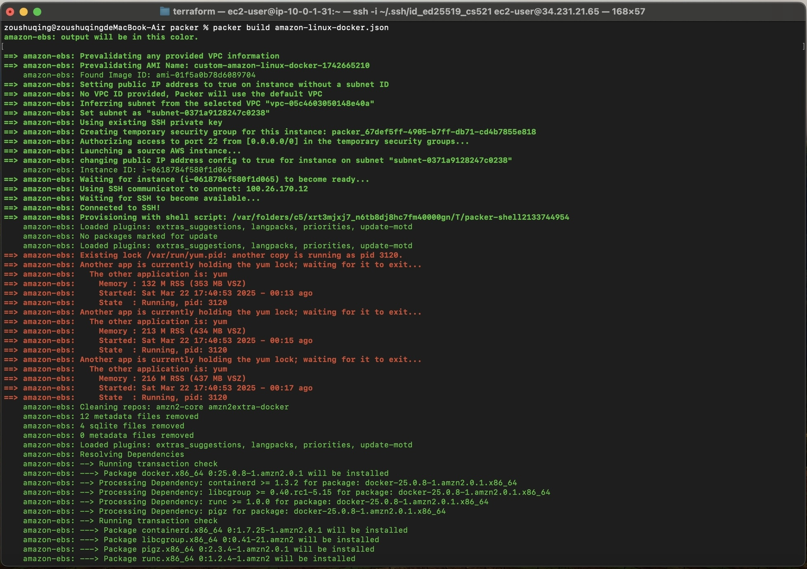
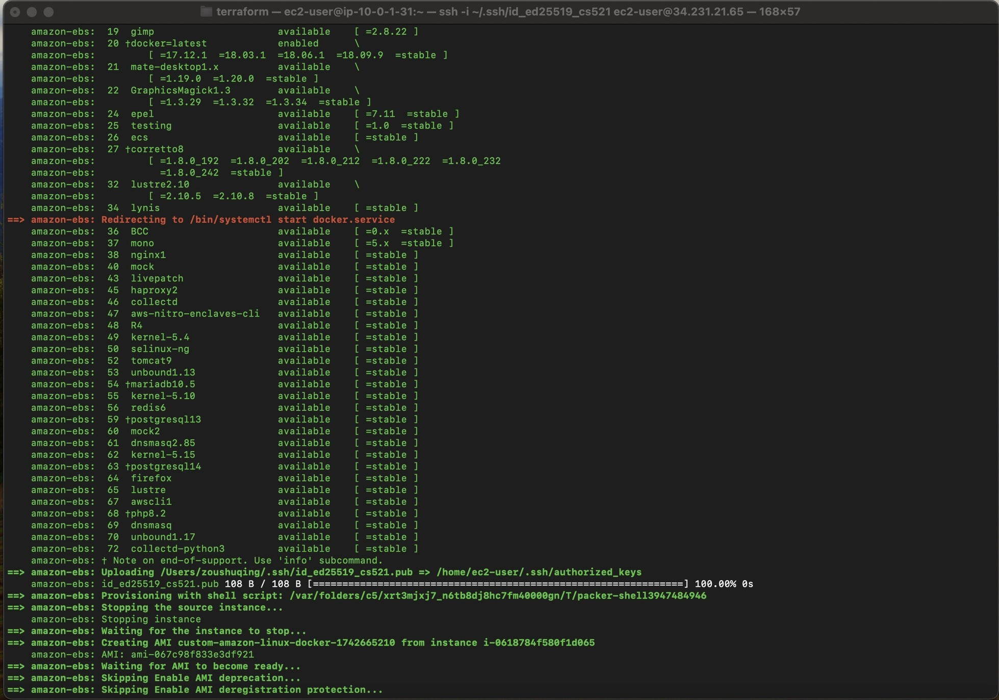
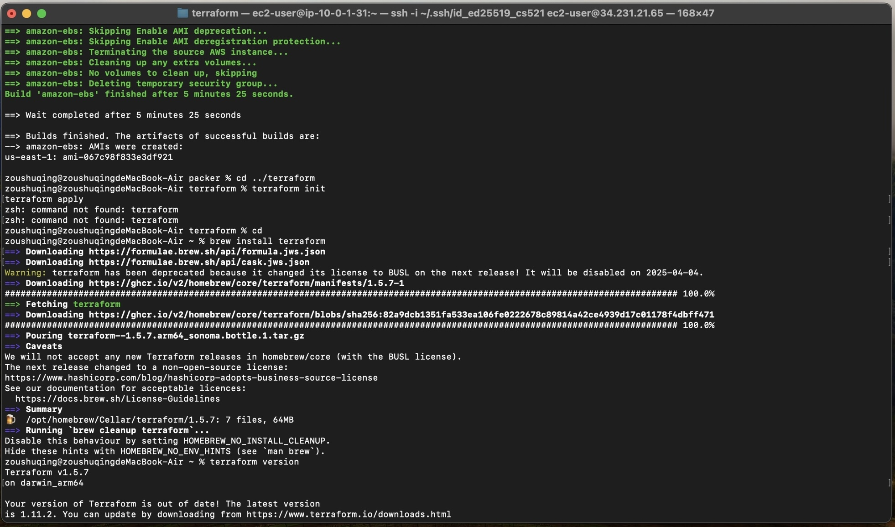
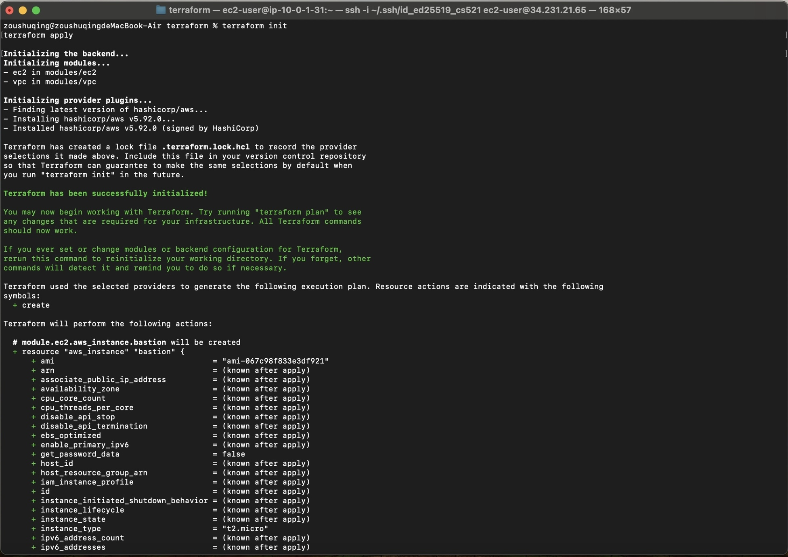
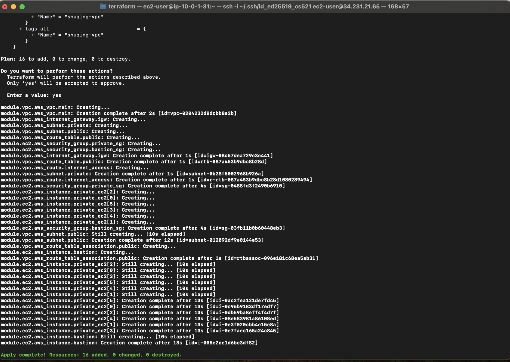
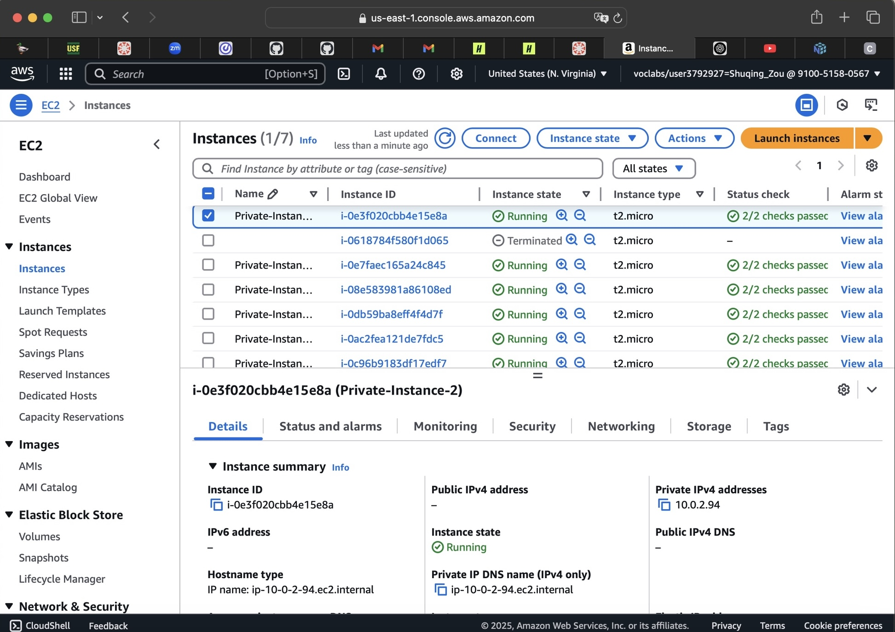

AWS Packer & Terraform Project
Project Overview
This project automates the provisioning of a secure and scalable AWS infrastructure using Packer and Terraform. It fulfills the following goals:
Part A: Custom AMI with Packer
1. Amazon Linux 2
2. Installs Docker
3. Configures SSH access using the public key

Part B: Infrastructure with Terraform (Using Modules)
1. VPC with public and private subnets
2. Internet Gateway and route tables
3. 1 Bastion host in public subnet (SSH restricted to your IP)
4. 6 EC2 instances in private subnet using the custom AMI

## How to Run

### 1. Build AMI using Packer
**Directory**: `packer/`

```bash
cd packer
packer build amazon-linux-docker.json
```
   
   
   
   

### 2. Deploy Infrastructure using Terraform  
**Directory**: `terraform/`

```bash
cd terraform
terraform init
terraform apply
```
   
   
   

### 3. SSH Access Instructions
Login to Bastion Host:
```bash
ssh -i ~/.ssh/<your-private-key> ec2-user@<bastion-public-ip>
```
   

